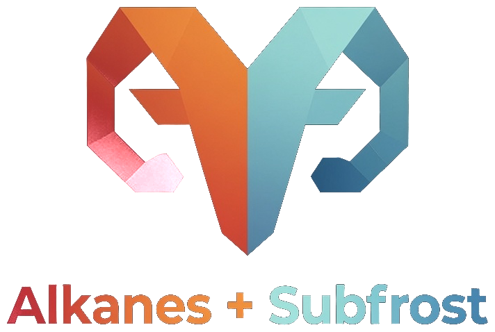

<div align="center">

<picture>
  <source media="(prefers-color-scheme: dark)" srcset="assets/aries-wordmark.png" />
  
</picture>



### Make any AI assistant fluent in building on Alkanes&nbsp;+&nbsp;Subfrost

[](#license)
[](https://modelcontextprotocol.io)
[](https://www.typescriptlang.org)
[](https://nodejs.org)

**[Use the hosted Aries API &nbsp;·&nbsp; bragi.build/aries](https://bragi.build/aries)**

</div>

---

Aries is a [Model Context Protocol](https://modelcontextprotocol.io) server that
gives any MCP-capable assistant — **Claude Code, Claude Desktop, Cursor** — a
knowledge and live-chain-data layer for the **Alkanes** metaprotocol and the
**Subfrost** network. Point your assistant at Aries and it can read the protocol
docs, query the live chain, and scaffold contracts without leaving the editor.

There are two ways to use it: the **hosted API** (recommended) and a
**bring-your-own-key local install**.

---

## The hosted API — the living Aries

> ### [Subscribe to hosted Aries &nbsp;·&nbsp; bragi.build/aries](https://bragi.build/aries)

The hosted edition is **live now** and it is the way to get the full Aries. It is
a **continuously-learning instance**: on top of the baseline docs it carries an
**ever-growing corpus of real-world lessons** — reviewed incident knowledge
contributed by every connected agent — that a fresh local clone does not have.
Connect one URL and your assistant inherits the whole shared brain, which gets
smarter every day.

| | |
| --- | --- |
| **Living corpus** | Accumulated, reviewed real-world gotchas and fixes — not just static docs. |
| **Zero setup** | No clone, no build, no key to provision. Connect and go. |
| **Tiered, managed access** | From a free tier up to production throughput, with rate limits handled for you. |
| **Always current** | The corpus and tools update server-side. |

Prefer to run everything yourself? The open, bring-your-own-key edition in this
repo is below.

## Hosted vs. local

Both editions ship the same **21 tools** and the same **75-doc baseline**. The
difference is the **living corpus** — and who manages the keys.

| | Hosted &nbsp;·&nbsp; [bragi.build/aries](https://bragi.build/aries) | Local &nbsp;·&nbsp; this repo |
| --- | --- | --- |
| All 21 tools | Yes | Yes |
| 75-doc baseline knowledge | Yes | Yes |
| Live Subfrost chain data | Yes — managed | Yes — your own key |
| **Living corpus of real-world lessons** | **Yes — ever-growing** | No |
| Accumulated incident learning | Yes | No (local store only) |
| Setup | Connect a URL | Clone, install, build |
| Subfrost key | Managed for you | You provide |
| Access | Free to production tiers | Unlimited, local |

Local gives you a complete, self-contained companion on the **static** baseline.
Hosted adds the **continuously-learning brain** on top. Start local if you like;
move to [hosted](https://bragi.build/aries) when you want the living corpus.

---

## Run it locally (bring your own key)

Clone this repo and run Aries on your own machine with your **own Subfrost API
key**. You get the full toolset and the complete **75-doc static baseline
knowledge** — without the hosted instance's accumulated learning.

### Get a Subfrost API key

Aries talks to the Subfrost gateway with your key.

> **[Sign up for a Subfrost API key](https://api.subfrost.io/auth/signup?ref=82D1DE7C)** —
> sign up with our Subfrost referral link and get **50% off your first month**.

### Quickstart

**Requirements:** [Node.js](https://nodejs.org) >= 20 and a
[Subfrost API key](https://api.subfrost.io/auth/signup?ref=82D1DE7C) (sign up with
our referral link for **50% off your first month**).

```bash
git clone https://github.com/bitbragi/alkanes-aries.git
cd alkanes-aries
npm install
cp .env.example .env        # then set SUBFROST_API_KEY (see below)
npm run build
```

Set your key in `.env`:

```bash
SUBFROST_API_KEY=your-key-here
# optional override:
# SUBFROST_RPC=https://mainnet.subfrost.io/v4/jsonrpc
```

The key is sent as the `x-subfrost-api-key` header (never in a URL) and never
leaves your machine except as that outbound header. `.env` is gitignored.

### Connect your MCP client

**Claude Code**

```bash
claude mcp add --scope local --transport stdio aries \
  -e SUBFROST_API_KEY=YOUR_KEY \
  -- node /absolute/path/to/alkanes-aries/dist/index.js
```

Verify with `claude mcp list`, then `/mcp` in a session. (`--` separates Claude's
flags from the launch command; keep `-e KEY=value` right before `--` — it is
variadic and will otherwise swallow the server name.)

**Cursor / Claude Desktop** — any client that takes a JSON server config:

```json
{
  "mcpServers": {
    "aries": {
      "command": "node",
      "args": ["/absolute/path/to/alkanes-aries/dist/index.js"],
      "env": { "SUBFROST_API_KEY": "your-key-here" }
    }
  }
}
```

Your assistant now has all 21 Aries tools.

---

## What's inside — 21 tools, four layers

| Layer | Tools |
| --- | --- |
| **Knowledge** — a searchable corpus of **75 curated docs**: the Alkanes metaprotocol, the Subfrost JSON-RPC/REST reference, alkanes-rs, tutorials, oracle docs, reference contracts | `aries_search`, `aries_doc`, `aries_full_doc`, `aries_catalog`, `aries_tutorials` |
| **Chain data** — live, read-only queries against the Subfrost gateway: holdings, contract metadata, bytecode, simulate, frBTC peg + DIESEL status, oracle reads, AMM pools, guarded RPC | `aries_tokens_by_address`, `aries_token`, `aries_contract_meta`, `aries_bytecode`, `aries_simulate`, `aries_frbtc_status`, `aries_diesel_status`, `aries_oracle_read`, `aries_oracle_price`, `aries_pools`, `aries_pool_info`, `aries_rpc` |
| **Dev** — protocol constants and contract scaffolds, including `orbital` NFTs | `aries_constants`, `aries_scaffold` |
| **Learning** — a local incident loop that records gotchas to your own machine as you work | `aries_incident_report`, `aries_incident_query` |

### Ask your assistant things like

> *"Is the frBTC peg live, who's the signer, and how much frBTC exists?"*
>
> *"What Alkanes tokens does `bc1p…` hold?"*
>
> *"Show the AMM pools and a pool's reserves."*
>
> *"How do I build a token / oracle / stablecoin / AMM / Orbital?"*
>
> *"Scaffold an Orbital NFT contract."*

---

## Safety — read-only by design

Aries is **analytics only**. It never signs, broadcasts, or touches wallets or
keys:

- The `aries_rpc` passthrough is **allowlisted to read methods** and explicitly
  blocks broadcast / spend / admin calls.
- Scaffolds and constants are emitted for **you** to run in your own `alkanes`
  CLI, where you hold the keys.
- The local incident loop writes only to your machine and sanitizes secrets,
  keys, and paths out of any report.

Your keys stay yours. Aries only reads and advises.

---

## Configuration

| Variable | Purpose |
| --- | --- |
| `SUBFROST_API_KEY` | **Required** — auth for the live chain-data tools. |
| `SUBFROST_RPC` / `SUBFROST_REST` | Optional gateway overrides (default to mainnet JSON-RPC / REST). |
| `ARIES_INCIDENTS_PATH` | Optional path for your local incident store (default `data/incidents.jsonl`, gitignored). |

Logs go to **stderr** only — stdout is the MCP protocol channel. The doc index
is built from `corpus/` at startup.

## Good to know

- Alkane ids are `{block, tx}` / `block:tx`. frBTC = `32:0`, DIESEL (genesis) =
  `2:0`. Protocol tag is always `1`.
- Read contract state with `aries_simulate`: the opcode goes in `inputs`
  (e.g. `[103]`), not `data`.
- **Orbitals** (Alkanes NFTs) are a `Token` with total supply 1 + opcode `1000`
  for media; read them with `aries_oracle_read`, scaffold one with
  `aries_scaffold orbital`.
- Extend the corpus by editing `corpus/` or adding URLs to `scripts/ingest.ts`
  (HTML cleaned via turndown + jsdom; raw `.md`/`.rs` taken verbatim).

## Links

| | |
| --- | --- |
| Hosted, continuously-learning Aries | **[bragi.build/aries](https://bragi.build/aries)** |
| Subfrost API keys (50% off first month) | **[api.subfrost.io](https://api.subfrost.io/auth/signup?ref=82D1DE7C)** |
| Model Context Protocol | **[modelcontextprotocol.io](https://modelcontextprotocol.io)** |

## License

MIT
