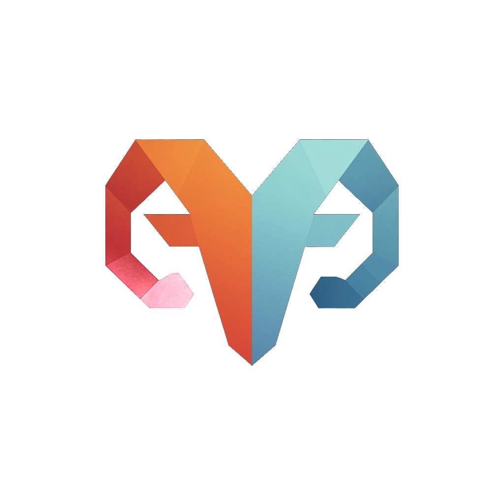

<div align="center">



<picture>
  <source media="(prefers-color-scheme: dark)" srcset="assets/aries-wordmark.png" />
  
</picture>

### Make your AI assistant fluent in building on Alkanes&nbsp;+&nbsp;Subfrost

[](https://modelcontextprotocol.io)
[](https://nodejs.org)
[](#-safety--read-only-by-design)
[](https://bragi.build/aries)
[](#license)

</div>

Aries is a [Model Context Protocol](https://modelcontextprotocol.io) server that
gives any MCP-capable AI — **Claude Code, Claude Desktop, Cursor** — a knowledge
and live-chain-data layer for the **Alkanes** metaprotocol and the **Subfrost**
network. Point your assistant at Aries and it can read the protocol docs, query
the live chain, and scaffold contracts — without leaving your editor.

---

## ⚡ The fastest path: hosted Aries

> ### 🧠 [**Subscribe to hosted Aries → bragi.build/aries**](https://bragi.build/aries)
>
> The hosted edition is a **living, continuously-learning instance.** Beyond the
> baseline docs, it carries an **ever-growing corpus of real-world lessons** —
> hard-won incident knowledge contributed by every connected agent — that a
> fresh local clone simply does not have. No setup, no key management: connect a
> URL and your assistant inherits the whole shared brain, getting smarter every
> day.

**Why hosted:**

- 🌱 **The living corpus** — accumulated, reviewed real-world gotchas and fixes, not just static docs.
- 🚀 **Zero setup** — no clone, no build, no key to provision. Connect and go.
- 🎚️ **Tiered access** — from a free tier up to production throughput, with rate limits handled for you.
- 🔄 **Always current** — the corpus and tools update server-side.

If you'd rather run everything yourself, the open, bring-your-own-key edition in
this repo has you covered. 👇

---

## 🛠️ Run it locally (bring your own key)

Clone this repo and run Aries on your own machine with your **own Subfrost API
key.** You get the full toolset and the complete **75-doc static baseline
knowledge** — minus the hosted instance's accumulated learning.

### Get a Subfrost API key

Aries talks to the Subfrost gateway with your key. Grab one here:

> 🔑 [**Sign up for a Subfrost API key**](https://api.subfrost.io/auth/signup?ref=82D1DE7C)
> — signing up through this referral link gets you **a discount on your first month**.

## 🆚 Local vs. hosted

Both editions ship the same 21 tools and the same 75-doc baseline. The
difference is the **living corpus** — and who manages the keys.

| | 🛠️ **Local** (this repo) | 🧠 **Hosted** ([bragi.build/aries](https://bragi.build/aries)) |
| --- | :---: | :---: |
| All 21 tools | ✅ | ✅ |
| 75-doc baseline knowledge | ✅ | ✅ |
| Live Subfrost chain data | ✅ (your key) | ✅ (managed) |
| **Living corpus of real-world lessons** | — | ✅ ever-growing |
| Accumulated incident learning | — | ✅ |
| Setup | clone · install · build | connect a URL |
| Subfrost key | you provide | managed for you |
| Access | unlimited, local | free → production tiers |

Local gives you a complete, self-contained companion on the **static** baseline.
Hosted adds the **continuously-learning brain** on top. Start local; upgrade to
[hosted](https://bragi.build/aries) when you want the living corpus.

## 🧰 What's inside — 21 tools, 3 layers

- 🧠 **Knowledge** — a searchable corpus of **75 curated docs**: the Alkanes
  metaprotocol, the Subfrost JSON-RPC/REST reference, alkanes-rs, step-by-step
  tutorials, oracle docs, and reference contracts.
  <br>→ `aries_search`, `aries_doc`, `aries_full_doc`, `aries_catalog`, `aries_tutorials`
- 🔗 **Live chain data** — read-only queries against the Subfrost gateway: token
  holdings, contract metadata, bytecode, `simulate`, frBTC peg + DIESEL status,
  oracle reads, AMM pools, and a guarded RPC passthrough.
  <br>→ `aries_tokens_by_address`, `aries_token`, `aries_contract_meta`, `aries_bytecode`,
    `aries_simulate`, `aries_frbtc_status`, `aries_diesel_status`, `aries_oracle_read`,
    `aries_oracle_price`, `aries_pools`, `aries_pool_info`, `aries_rpc`
- 🛠️ **Dev scaffolds** — protocol constants and contract templates, including
  `orbital` NFTs.
  <br>→ `aries_constants`, `aries_scaffold`

Plus a **local** learning loop (`aries_incident_report` / `aries_incident_query`)
that records gotchas to your own machine as you work.

### Ask your assistant things like

> *"Is the frBTC peg live, who's the signer, and how much frBTC exists?"*
> *"What Alkanes tokens does `bc1p…` hold?"*
> *"Show the AMM pools and a pool's reserves."*
> *"How do I build a token / oracle / stablecoin / AMM / Orbital?"*
> *"Scaffold an Orbital NFT contract."*

## 🚀 Quickstart (~2 minutes)

**Requirements:** [Node.js](https://nodejs.org) ≥ 20 and a
[Subfrost API key](https://api.subfrost.io/auth/signup?ref=82D1DE7C).

```bash
git clone https://github.com/bitbragi/alkanes-aries.git
cd alkanes-aries
npm install
cp .env.example .env        # then edit .env (see below)
npm run build
```

Set your key in `.env`:

```bash
SUBFROST_API_KEY=your-key-here
# optional override:
# SUBFROST_RPC=https://mainnet.subfrost.io/v4/jsonrpc
```

The key is sent as the `x-subfrost-api-key` header (never in a URL) and never
leaves your machine except as that outbound header. `.env` is gitignored.

### Connect your MCP client

**Claude Code**

```bash
claude mcp add --scope local --transport stdio aries \
  -e SUBFROST_API_KEY=YOUR_KEY \
  -- node /absolute/path/to/alkanes-aries/dist/index.js
```

Verify with `claude mcp list`, then `/mcp` in a session. (`--` separates Claude's
flags from the launch command; keep `-e KEY=value` right before `--` — it's
variadic and will otherwise swallow the server name.)

**Cursor / Claude Desktop** (any client that takes a JSON server config)

```json
{
  "mcpServers": {
    "aries": {
      "command": "node",
      "args": ["/absolute/path/to/alkanes-aries/dist/index.js"],
      "env": { "SUBFROST_API_KEY": "your-key-here" }
    }
  }
}
```

That's it — your assistant now has all 21 Aries tools.

## 🔒 Safety — read-only by design

Aries is **analytics only**. It never signs, broadcasts, or touches wallets or
keys:

- The `aries_rpc` passthrough is **allowlisted to read methods** and explicitly
  blocks broadcast / spend / admin calls.
- Scaffolds and constants are emitted for **you** to run in your own `alkanes`
  CLI, where you hold the keys.
- The local incident loop writes only to your machine and sanitizes secrets,
  keys, and paths out of any report.

Your keys stay yours. Aries only reads and advises.

## ⚙️ Configuration

| Var | Purpose |
| --- | --- |
| `SUBFROST_API_KEY` | **Required** — auth for the live chain-data tools. |
| `SUBFROST_RPC` / `SUBFROST_REST` | Optional gateway overrides (default to mainnet JSON-RPC / REST). |
| `ARIES_INCIDENTS_PATH` | Optional path for your local incident store (default `data/incidents.jsonl`, gitignored). |

Logs go to **stderr** only — stdout is the MCP protocol channel. The doc index
is built from `corpus/` at startup.

## 💡 Good to know

- Alkane ids are `{block, tx}` / `block:tx`. frBTC = `32:0`, DIESEL (genesis) =
  `2:0`. Protocol tag is always `1`.
- Read contract state with `aries_simulate`: the opcode goes in `inputs`
  (e.g. `[103]`), not `data`.
- **Orbitals** (Alkanes NFTs) are a `Token` with total supply 1 + opcode `1000`
  = media; read them with `aries_oracle_read`, scaffold one with
  `aries_scaffold orbital`.
- Extend the corpus by editing `corpus/` or adding URLs to `scripts/ingest.ts`
  (HTML cleaned via turndown + jsdom; raw `.md`/`.rs` taken verbatim).

## 🔗 Links

- 🧠 Hosted, continuously-learning Aries — **[bragi.build/aries](https://bragi.build/aries)**
- 🔑 Subfrost API keys — **[api.subfrost.io](https://api.subfrost.io/auth/signup?ref=82D1DE7C)**
- 📖 Model Context Protocol — **[modelcontextprotocol.io](https://modelcontextprotocol.io)**

## License

MIT
